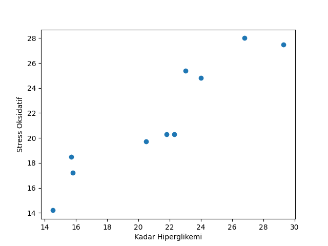

### Sample Output

```
Data:
Kadar Hiperglikemi      Stress Oksidatif
15.8                    17.2
22.3                    20.3
14.5                    14.2
15.7                    18.5
26.8                    28.0
24.0                    24.8
21.8                    20.3
23.0                    25.4
29.3                    27.5
20.5                    19.7

n: 10
b1: 0.8824776644981137
b0: 2.7314523096753085
R2: 87.22665916051724 %
Plotting...
Done.
```

--

### Sample Plot

