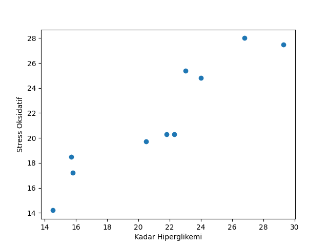

### Sample Output

```
Data:
Kadar Hiperglikemi      Stress Oksidatif
15.8                    17.2
22.3                    20.3
14.5                    14.2
15.7                    18.5
26.8                    28.0
24.0                    24.8
21.8                    20.3
23.0                    25.4
29.3                    27.5
20.5                    19.7

n: 10
sum x: 213.70000000000002
sum y: 215.9
sum x2: 4780.889999999999
sum y2: 4852.450000000001
sum xy: 4802.74
r: 0.9339521356071586
t: 7.391240989355199
p-value: 7.68368054887321e-05
summary: Ho rejected, Ha approved.
relation level: very strong
Plotting...
Done.
```

---

### Sample Plot

