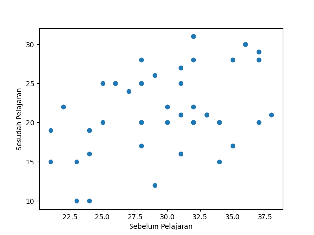

### Output

```
Data:
Sebelum Pelajaran       Sesudah Pelajaran
25.0                    20.0
23.0                    15.0
35.0                    17.0
21.0                    15.0
24.0                    10.0
31.0                    27.0
32.0                    31.0
37.0                    29.0
38.0                    21.0
30.0                    20.0
29.0                    26.0
24.0                    19.0
34.0                    15.0
37.0                    20.0
28.0                    25.0
23.0                    10.0
29.0                    12.0
25.0                    25.0
32.0                    28.0
30.0                    22.0
32.0                    20.0
31.0                    21.0
37.0                    28.0
22.0                    22.0
28.0                    17.0
21.0                    19.0
33.0                    21.0
31.0                    16.0
28.0                    28.0
32.0                    20.0
24.0                    16.0
27.0                    24.0
33.0                    21.0
34.0                    20.0
26.0                    25.0
28.0                    20.0
32.0                    22.0
31.0                    25.0
36.0                    30.0
35.0                    28.0

n: 40
t: 9.833579178068444
p-value: 4.106974892061369e-12
Plotting...
Done.
```
---

### Plot
